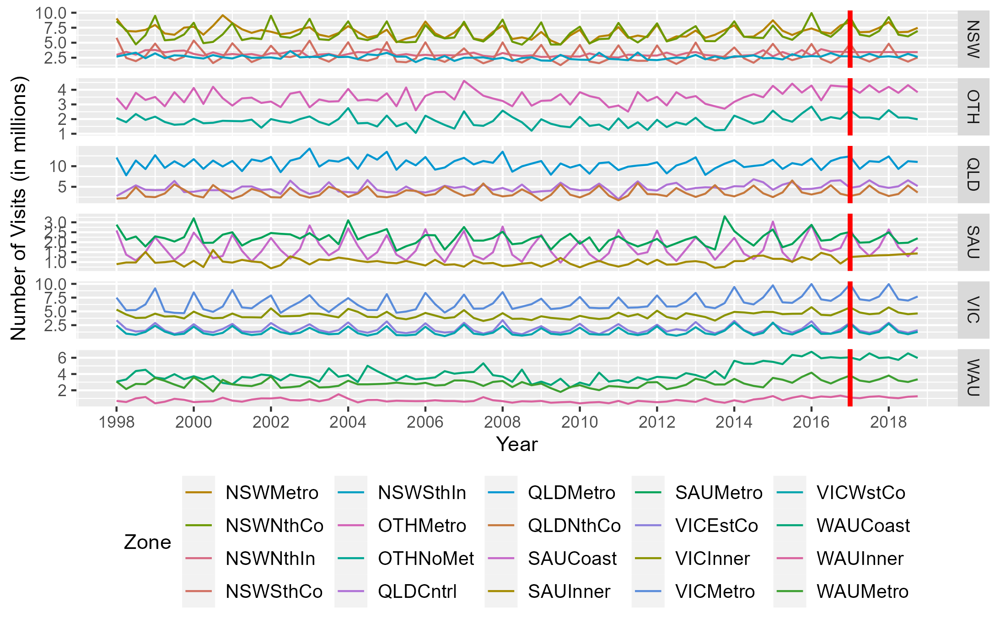

# Hierarchical time series

Performed Hierarchical time series on quarterly visitor nights for various regions of Australia. The data `visnights` is from the `fpp2` r package. The quarterly data is from 1998-2016 for six states and twenty regions (zones). The states include New South Wales (NSW), Queensland (QLD), South Australia (SAU), Victoria (VIC), Western Australia (WAU) and Other (OTH). The quarterly domestic tourism demand, measured as the number of visitor nights Australians spend away from home.

Business planners and tourism authorities are interested in forecasts for the whole of Australia, for the states and the territories, and also for the zones.

The zones for the folling states are 

NSW - 	Metro (NSWMetro), North Coast (NSWNthCo), South Coast (NSWSthCo), South Inner (NSWSthIn), North Inner (NSWNthIn)

QLD - Metro (QLDMetro), Central (QLDCntrl), North Coast (QLDNthCo)

SAU -	Metro (SAUMetro), Coastal (SAUCoast), Inner (SAUInner)

VIC -	Metro (VICMetro), West Coast (VICWstCo), East Coast (VICEstCo), Inner (VICInner)

WAU	- Metro (WAUMetro), Coastal (WAUCoast), Inner (WAUInner)

OTH	- Metro (OTHMetro), Non-Metro (OTHNoMet)

There are no missing values. The figure below show the total visitors and visitors by states. The WAU state has seen an increase in total visits in the last few years. The rest of the states there is a seasonal pattern for visits.

The figure below shows the visits for each zones by the states of Australia.

We fitted the bottom-up, top-bottom, middle-out, and optimal reconciliation to find the best forecast model. The table below shows the results on the fitted model on the test data for the total, states, and zone visits. We used the optimal reconciliation for forecasting the following year. 

The following plots are  the predicted total visits for Australia as a whole, by states, and the zones within each states. The historical data show a increase in the trend with a seasonal pattern within the year for the total number of visits. The model captures that information and predict a decrease in total number of visits in the first few quarters of the year 2017. The second figure, predicts WAU state to have high number of visitors throughout out the year. The zone with highest predicted number of visits for WAU is the zone 'Coast'

Note: The line to the right of the red vertical line represents the forecast predictions. 

